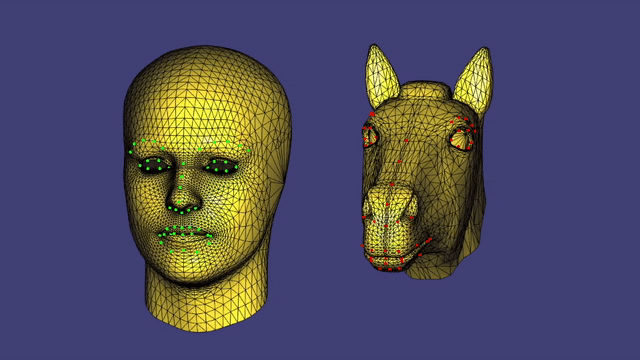

# DeformXfer

An Eigen/libIGL (C++) implementation of [Deformation Transfer for Triangle Meshes](https://people.csail.mit.edu/sumner/research/deftransfer/), largely based on the Python implementation of [Landmark-guided Deformation Transfer of Template Facial Expressions for Automatic Generation of Avatar Blendshapes](https://github.com/diegothomas/Avatar-generation-3DRW2019-).

## Demo Videos
| [](https://youtu.be/Uc_37SjT8us) |
| :--: |
| *Transferring deformation from a human avatar (driven by blendshapes) to a horse head.* |

| [](https://youtu.be/hjm96S8C7pc) |
| :--: |
| *Morphing topology of the horse head to match the human avatar (for mapping mesh correspondences).* |

## Building the Demo Program

Currently, _DeformXfer_ has only been tested on MacOS.

To build the demo program with CMake, run the following commands in a shell:
```console
git clone https://github.com/jerenchen/deformxfer
cd deformxfer
mkdir .build
cd .build
cmake -DCMAKE_CXX_FLAGS="-O3 -DNDEBUG" ..
make
```
Once building is complete, launch the demo program (in the same `.build` directory) by running:
```console
./dx_demo
```

## License

_DeformXfer_ is licensed under the the _BSD 3-Clause "New" or "Revised"_ license.
